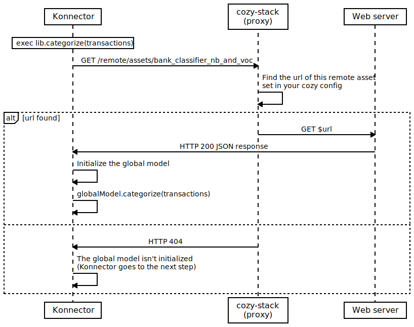

# cozy-global-model-classificator


## Install

1. Install dependencies : `yarn`
2. Copy the file `data.example.json` to `data.json`
3. Modify the file `data.json` with your data
4. Launch the script: `yarn start` to generate the file `bank_classifier_nb_and_voc.json`
5. Copy the generated json file on your web server
6. Update your cozy config :

    ```yaml
    # Example for cozy.yml

    remote_assets:
        bank_classifier_nb_and_voc: $URL_TO_YOUR_JSON_FILE
    ```

7. Reload cozy-stack


## How does it work?

### Context

The goal of this project is to make available the global categorization model for self-hosted instances of Cozy. This gobal model is shared with all cozy-bank konnectors, if all are compatible with the categorization system of cozy. By default, on self hosted instance, the global model is ignored because the bayes model is missing. Only the local model is used.


[Cozy documentation](https://docs.cozy.io/en/cozy-konnector-libs/api/#module_categorization):

> The global model is a model specific to hosted Cozy instances. It is not available for self-hosted instances. It will just do nothing in that case.


### Workflow



### Create the bayes model missing

As explained in the workflow, when the model is missing, the konnector goes the next step. This model has a particular format. To create it, the script  `classificator.js` initializes a bayes classificator and reads your data (`data.json`) to learn them. Then, the script exports the model to a JSON file.

The last step is to copy/move the JSON file to your web server. After that, the model is available and your cozy-bank konnectors can initialize a global model. Congratualations! :)


## License

cozy-global-model-classificator is developed by [Orandin](https://github.com/orandin) and distributed under the [AGPL v3 license][agpl-3.0].


[agpl-3.0]: https://www.gnu.org/licenses/agpl-3.0.html
